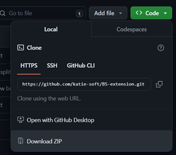
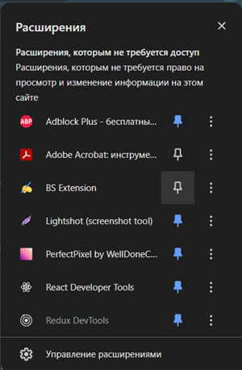

## Расширение для редактирования статей БС

Это небольшое расширение поможет вам легко переключаться между режимом редактирования и просмотра превью статей. 
Также добавлена возможность оборачивать выделенный текст в теги по сочетанию клавиш.

### Как установить

1. Скачайте код расширения [с этой страницы](https://github.com/katie-soft/BS-extension) в виде архива (Code -> Download ZIP)  
   
2. Распакуйте архив локально (Extract all...)
3. В браузере Google Chrome перейдите в Управление расширениями (chrome://extensions/)
4. В правом верхнем углу переведите ползунок в режим разработчика  
   
5. Нажмите на кнопку Загрузить распакованное расширение и выберите папку, в которую распаковали архив с кодом. Расширение установится автоматически.
6. Для того, чтобы закрепить иконку расширения на верхней панели, нажмите на булавку напротив названия расширения.  
   

### Как пользоваться

- **Чтобы перейти со страницы статьи к ее редактированию:**

Находясь на странице статьи (например, <https://secrets.tinkoff.ru/lifestyle/film-pro-investitsii/>), нажмите на значок расширения и выберите **Edit page**.
В новой вкладке откроется статья с возможностью редактирования.

- **Чтобы перейти от редактирования к превью:**

Находясь на странице статьи в админке, нажмите на значок расширения и выберите **Open preview**.
Превью статьи откроется в новой вкладке.

- **Чтобы включить возможность оборачивать текст в теги:**

Находясь на странице статьи в админке, нажмите на значок расширения и выберите **Hot keys**. 

- **Чтобы обернуть текст в тег `<strong>` или `<mark>`:**

1) Включите возможность оборачивать текст в теги через кнопку Hot keys в расширении.
2) Выделите текст, который нужно обернуть в тег.
3) Нажмите сочетание клавиш:
- Ctrl + Shift + S для тега `<strong>`
- Ctrl + Shift + Y для тега `<mark>`
4) Нажмите Ctrl+V: текст в теге вставится на место выделенного текста.

- **Чтобы обернуть текст в тег `<a>`:**

1) Включите возможность оборачивать текст в теги через кнопку Hot keys в расширении.
2) Скопируйте ссылку, которую хотите указать в атрибуте href. 
3) Выделите текст, который нужно обернуть в тег `<a>`.
4) Нажмите сочетание клавиш Ctrl + Shift + H.
5) Нажмите Ctrl+V: текст в теге `<a>` вставится на место выделенного текста. Скопированная ранее ссылка будет добавлена в атрибут href.

- **Чтобы добавить неразрывный пробел (&nbsp):**

1) Включите возможность оборачивать текст в теги через кнопку Hot keys в расширении.
2) Нажмите сочетание клавиш Ctrl + Shift + X.
3) Поставьте курсор в то место, где нужно добавить неразрывный пробел и нажмите Ctrl+V.